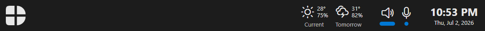
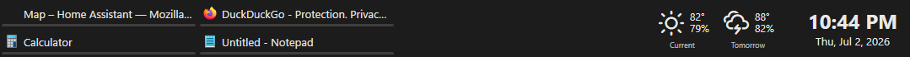
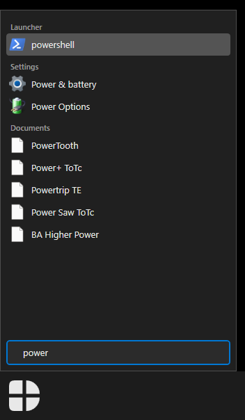
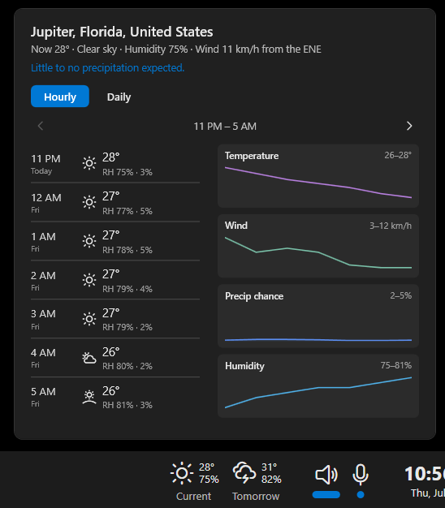
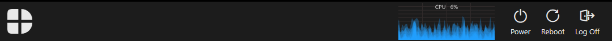
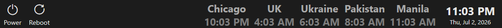
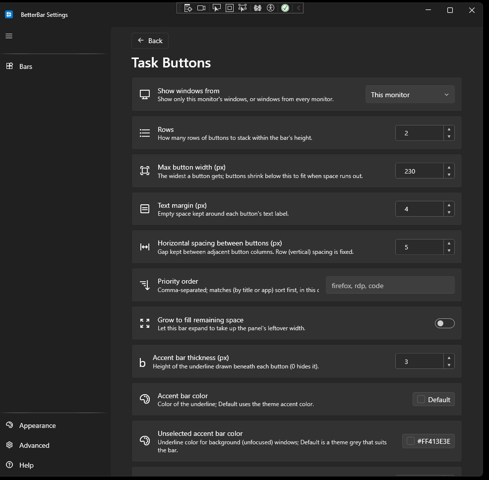

<!-- markdownlint-disable MD033 MD026 -->
<!-- MD033: inline HTML is intentional; GitHub markdown can't size/center images without it.
     MD026: "Clocks. Plural." is a deliberate stylistic heading. -->

# BetterBar: see it in action

  

Somewhere between Windows 7 and Windows 11, the taskbar stopped working for you and
started working on you. It grew a Widgets button, a Copilot button, and a search box
the size of a sedan, all while quietly losing the things people actually used: Quick
Launch, multiple rows, labels you could read, and the radical notion that *you*
decide what's on your own taskbar.

**BetterBar** is a return to a simpler contract: the bar shows what you put on it.
Nothing more, nothing less, and nothing that phones home to a news feed.

Every screenshot below is a real bar built from the same simple pieces: pick a
monitor, pick an edge, stack the widgets you want in the order you want them.

---

## Task buttons that behave like task buttons

  

One button per window. With a **label**. In **two rows**, if you like: a feature
Windows shipped for two decades and then decided you'd outgrown. Buttons shrink
gracefully when the bar fills up, a configurable priority order pins your important
apps to the front, and the Windows 11-style accent underline is yours to restyle
(thickness, colors, widths). Or set it to zero and pretend the 2020s never happened.

And no, hovering over a button does not launch a floating preview theater. Click it,
it focuses. Click it again, it minimizes. Like it's supposed to.

## A start menu that searches, and only searches

  

Type. Get results. Launch. The menu searches your apps, Windows settings pages,
documents, Quick Launch, and any custom folders you point it at, grouped by source
and ranked by **frecency** so the things you actually use float to the top. Define
**aliases** (`ps` → *powershell*) for the muscle-memory crowd.

What it will not do: suggest a web search, recommend an app you didn't ask for, or
show you "content." It's a start menu, not a storefront. The lone **Windows key**
opens it, and every Win+key combo (Win+E, Win+R, ...) still passes through untouched.

## Weather that opens... weather

  

On the bar: current conditions plus an at-a-glance forecast window (*Tomorrow*, next
2 hours, 3 days, your call), with the icon showing the **worst** conditions expected
so you know whether to bring the umbrella. Click it and you get (brace yourself)
**a weather forecast.** Hourly and daily tabs, paging through a full 48 hours / 14
days with live charts for temperature, wind, precipitation, and humidity.

Not a single celebrity headline in sight. Data by
[Open-Meteo](https://open-meteo.com), no account, no tracking.

## Keep an eye on things

  

A live **CPU graph**, every logical core drawn as overlapping translucent fills,
riding right on the bar, with network throughput monitors available in the same
style. Next to it, **Power** buttons: shut down, restart, sleep, sign out, one click
each (with an optional "are you sure?" if your cat walks on the mouse). No hunting
through a start menu's power flyout's confirmation submenu.

## Clocks. Plural.

  

Every clock is its own widget with its own **title**, **time zone**, format, and
fonts, so a world clock row is just... several clocks. Distributed team? Family
overseas? Servers in another region? Line them up. The local clock still opens a
themed calendar flyout when clicked.

## Configured, not "customized within approved limits"

  

Every widget has a settings page like this one, in a single Fluent settings window.
Rows, sizes, margins, colors, behaviors: real numbers you type into real fields, not
three curated toggles and a survey about your feedback. Changes apply **live** to
every bar as you edit.

Bars themselves follow the same philosophy: a **Bar Definition** is a reusable layout
(edit it once, every placement updates), and a **Panel** places it on a monitor edge.
Design one bar for your main monitor and a minimal one for the second screen, or
run four bars, top and bottom. It's your desktop.

---

## The rest of the toolbox

Not pictured above, but in the box:

- **Quick Launch / Launchers**: a grid of shortcuts from any folder, drag-to-reorder,
  drag-in from Explorer, real shell context menus. Yes, *that* Quick Launch. Back
  from the dead.
- **System Tray**: BetterBar hosts the real Windows notification area, on its own
  thread so a burst of startup icons never freezes the bar.
- **Audio Control**: speaker and mic buttons with live level meters (smoothed and
  auto-scaled), device-picker flyouts, and a volume slider.
- **Themes**: dark and light built in, plus a full theme editor: every palette entry,
  down to the task-button corner radius. Import and export your creations.
- **Separators**: including grow-to-fill spacers to push things to the far edge.

## Get it

Grab **`BetterBar-win-Setup.exe`** from the
[Releases](https://github.com/Renbo2024/better-bar/releases) page. A short first-run
wizard builds your first bar in under a minute; it can hide the native taskbar for
you (and politely restores it, auto-hide preference included, when BetterBar
exits). Updates arrive automatically from GitHub Releases.

The full feature reference lives in the [README](../README.md). BetterBar is free
software under the [GPLv3](../LICENSE).

*Your taskbar. Remember when that phrase meant something?*
